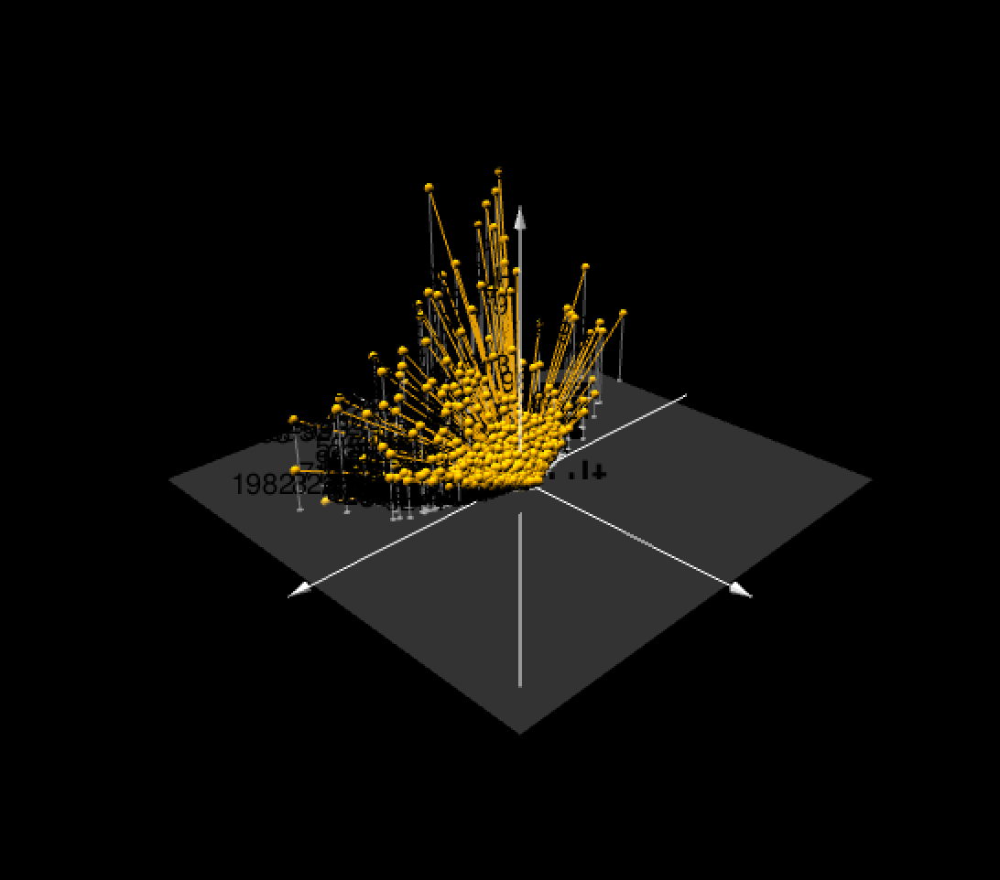

# Classification of Vessel Geartype 

Machine learning class final project

Fig 1.Map of Apparent Fishing Effort <em> “Copyright [2022], Global Fishing Watch, Inc., www.globalfishingwatch.org.” </em>

## Overview

This dataset contains the [Global Fishing Watch](https://globalfishingwatch.org/datasets-and-code/) AIS-based fishing effort and vessel presence datasets .Data is based on fishing detections of >114,000 unique AIS devices on fishing vessels, of which ~70,000 are active each year. Fishing vessels are identified via a neural network classifier, vessel registry databases, and manual review by GFW and regional experts. Data are binned into grid cells 0.01 (or 0.1) degrees on a side and measured in units of hours. The time is calculated by assigning an amount of time to each AIS detection (which is the time to the previous position), and then summing all positions in each grid cell.

Using Global Fishing Watch fishing effort vessel data, I use several machine learning classification models to predict geartype of fishing vessels.
From the 16 available classes of geartype my outcome variable will be based on these five classes:

"set_longlines", "set_gillnets", "tuna_purse_seines",	"fishing",			
"other_purse_seines","	drifting_longlines"

## Models used 

Fig2.Visual representation of three principal components from the vessel data

1. PCA
3. Lasso and Elastic-Net Regularized Generalized Linear 
4. Decision Tree
5. Random Forest
6. Boosted Tree
7. KNN
8. Neural Network

## Folders
1. data 
2. images
3. metadata (i.e. contains codebook)
4. model_results

## References

“Copyright [2022], Global Fishing Watch, Inc., www.globalfishingwatch.org.”

<em>“Global Fishing Watch has made every attempt to ensure the completeness, accuracy and reliability of the information provided on this Site. However, due to the nature and inherent limitations in source materials for information provided, Global Fishing Watch qualifies all designations of vessel fishing activity, including synonyms of the term “fishing activity,” such as “fishing” or “fishing effort,” as “apparent,” rather than certain.  And accordingly, the information is provided “as is” without warranty of any kind.”</em>

Clavelle, Tyler. “Working with Our Downloadable Public Data in R.” Global Fishing Watch, 29 May 2019, https://globalfishingwatch.org/data/working-with-our-downloadable-public-data-in-r/.

Flanders Marine Institute (2019). Maritime Boundaries Geodatabase: Maritime Boundaries and Exclusive Economic Zones (200NM), version 11. Available online at https://www.marineregions.org/. https://doi.org/10.14284/386

